Total Word Count:  2,986
Part 1: 585
Part 2: 573
Part 3: 1,828

Part 1

An attempt was made to produce identical choropleths of green roof (GR) drainage area proportions by ward for Washington, DC using QGIS and R. Since the products are similar, direct comparison of the processes used and choropleths developed can be conducted. In QGIS and R, green roofs were extracted from “Best Management Practices” (“BMP”) data by querying on the “Green_Roof” field (DCGISopendata, 2015). The contributing drainage of these records was then summed, by ward, and spatially joined with wards from “Wards from 2012” (“Wards”) data (DCGISopendata, 2017). A new variable was then created to capture the proportion of total drainage area within each ward. Finally, this statistic was visualized using a graduated greens palette and projected on OpenStreetMap basemaps. The choropleths indicate that ward 6 has the greatest GR drainage area. 
```{r echo=FALSE, fig.height=4, fig.width=3}
knitr::include_graphics("1.png")

```
	While R and QGIS each have their strengths, R seems more adequate for statistical analysis and handling larger datasets is computationally cheaper. Combining this power with libraries, R is undoubtedly superior at handling raw data. However, its command-line nature means that the user must keep running the same lines of code to visualize graphical alterations. Additionally, certain features (fonts, scale-bar units, etc.) are not as customizable as in QGIS. In contrast, QGIS’s drag-and-drop GUI is much more interactive and provides immediate visualization. One drawback of both GUIs and command-line programs is the functionality of third-party libraries and plug-ins. At best, the tools or code work with hiccups, but it is not out of the ordinary for their functionality to be lost between version updates.  
```{r echo=FALSE, fig.height=4, fig.width=3}
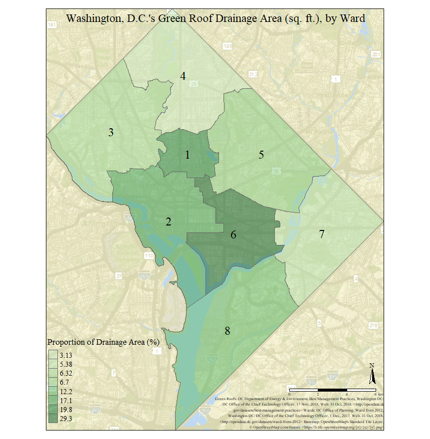

```
	The choropleths produced rely on “Wards” data and “BMP” data that was compiled by the DC government. As a result, the “BMP” data are three-years old and are likely missing GRs. Likewise, there are redundant fields for “BMP” data and the metadata do a poor job at describing variables. While OpenStreetMap basemaps were used for context in both choropleths, this was notably easier in R than in QGIS, as it failed to read some tile files. In contrast, QGIS’s map is far more visually appealing than R’s. The contextual second map and presence of a standalone legend direct the eye around the page, which is preferable. The R choropleth causes the eye to focus on the center of the image. While both maps are projected via long-lat with a WGS84 datum and ellipsoid, the R map appears to have stretched DC vertically. While the modifiable areal unit problem (MAUP) would be an issue if the total GR drainage of each ward was visualized, using proportion of drainage mitigates this (Openshaw, 1983). If the unit of measure was changed, the proportion of drainage in ward 6 would still be greater than all other wards. Furthermore, it is logical that GR drainage should be represented by graduated shades of green, but this poses an issue for the visually impaired. Nonetheless, because the choropleths are overlaid on basemaps, which distinguish between the areas of focus and context, the map is hopefully still readable. While the use of graduated colors may verge on “lying with maps” (Monmonier, 2005, pp. 218-219), in that the variation of greens is not directly proportionate to the difference in drainage proportions, it serves the purpose of showing which wards have a disproportionate amount of drainage. 
Overall, the final R product looks less jazzy (basic font, reference position, etc.), and even though they are not perfect, the choropleths serve their purpose: to show that wards 1, 2, and 6 contain a disproportionate GR drainage area, relative to their overall size.


References
DCGISopendata. (2015). “Best Management Practices”. D.C. Office of the Chief Technology	Officer. Available at: http://opendata.dc.gov/datasets/best-management-practices
DCGISopendata. (2017). “Wards from 2012”. D.C. Office of the Chief Technology Officer.	Available at: http://opendata.dc.gov/datasets/ward-from-2012?geometry=-	77.516%2C38.707%2C-76.512%2C39.081
Monmonier, M. (2005). Lying with Maps. Statistical Science, 20(3), pp. 215-222.
Openshaw, S. (1983). The Modifiable Areal Unit Problem. Norwick: Geo Books.


Part 2
Since ArcGIS was used, GeoJSON files required transformation to Shapefiles before use in ArcGIS. Team Seven’s data from 2016 was used. QGIS was used to re-project all data into Shapefiles, using the BNG (ESPG:27700). Re-projecting to BNG made for easy ArcGIS importation and preserved distance measurements, for the UK. Point locations were compiled using week seven’s practical. Data for “King’s Cross” was corrected. City of London’s wards were consolidated using the “Merge” function from the “Editor Toolbar”. After this, the “Join” tool wards data was joined to the polygons feature class.  
1.
Team Seven travelled approximately 46.604 kilometers on their treasure hunt. This figure was calculated in a new field by calculating geometry. Geometric property “length” was selected, with units set to kilometers. The function measured the polyline with respect to BNG and its unit of measure.  
2.
Team Seven passed within 100m of 24 stations on their hunt. To compute this, the “Buffer” tool from the “Geoprocessing” toolbox was used to generate a new polygon representing a 100m radius on the team’s route. “Select By Location…” was used to select and count stations intersecting the buffer. 
```{r echo=FALSE, fig.height=4, fig.width=3}
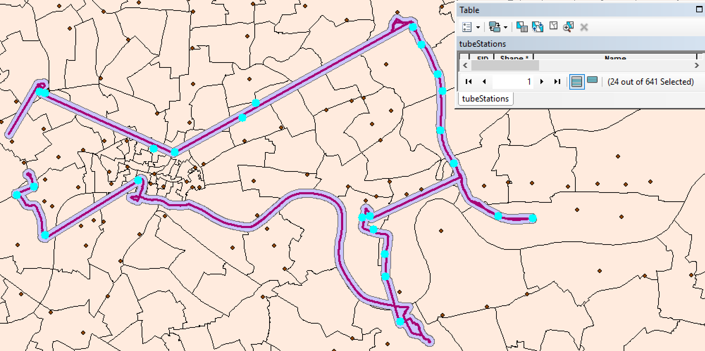

```
3.
The workflow of this solution is methodologically similar to question two. “Buffer” was used to generate a polygon representing a 300m buffer, then a “Select By Location…” query was used to highlight all point-locations within 300m of the route. Statistics of the seventeen selected stations show that their values sum to 62 points. It is worth noting that this question and question two can be solved with less steps by using a “Select By Location…” query to select points within a given distance; however this alternative does not produce a visible buffer. 
```{r echo=FALSE, fig.height=4, fig.width=3}
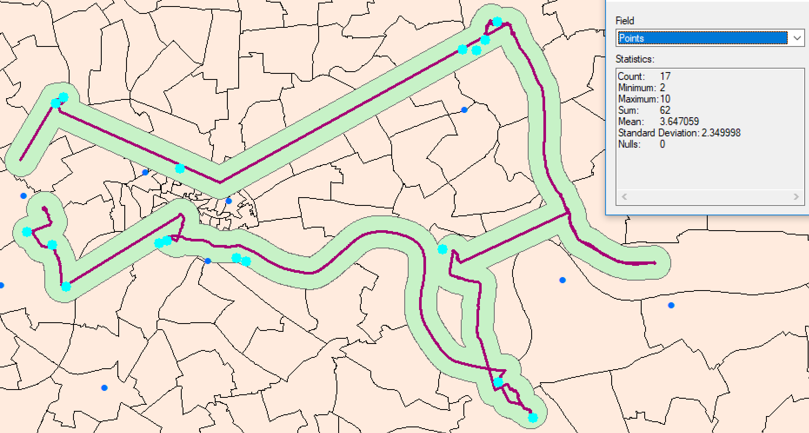

```
4.
City of London has the greatest male life expectancy at 84.31 and Weavers has the lowest at 75.06 years. To compute these figures, “Select By Location…” was utilized to choose wards intersecting the route. Selected wards were then exported as a new layer; the attribute table shows City of London, Weavers, and their life expectancies. 
```{r echo=FALSE, fig.height=4, fig.width=3}
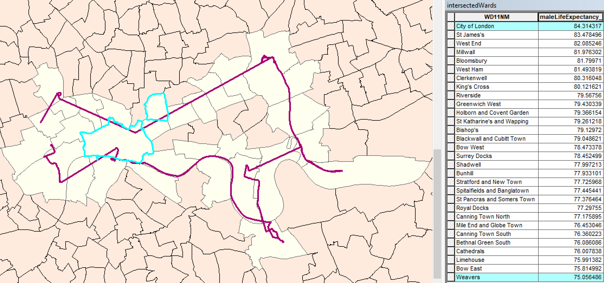

```
5.
Mean life expectancy for intersected wards is 81.43 years. To compute this, wards’ average life expectancies were calculated from their respective male and female life expectancies as a new field. Using “Select By Location…”, wards intersecting the route were selected, and exported as a new layer. Using this new layer, “Statistics” for average life expectancy were generated to obtain the mean life expectancy for intersected wards.  
```{r echo=FALSE, fig.height=4, fig.width=3}
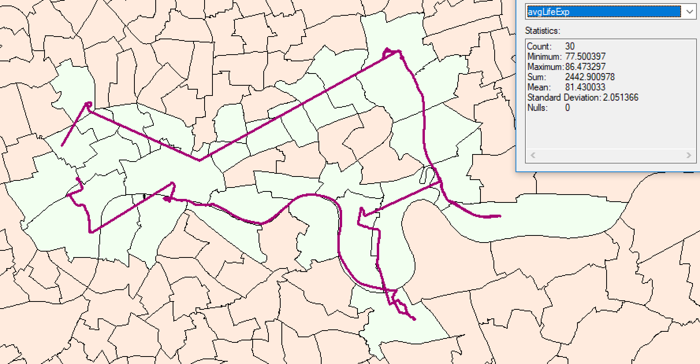

```
6.
According to quadrat analysis, Ripley’s K, and DBSCAN, the point locations are spatially clustered. To start, wards and point locations were imported into R, since DBSCAN is simpler to conduct than in ArcGIS, then a quadrat analysis was conducted. This showed clustering more significant than a random Poisson distribution would predict in 4 grids; however, this analysis suffers greatly from issues of MAUP (Kwan, 2012). To address these drawbacks, Ripley’s K Test was conducted (Ripley, 1977, p. 172). It indicated that as the test radius expanded, clustering became more significantly significant; this is expected, but there 
```{r echo=FALSE, fig.height=4, fig.width=3}
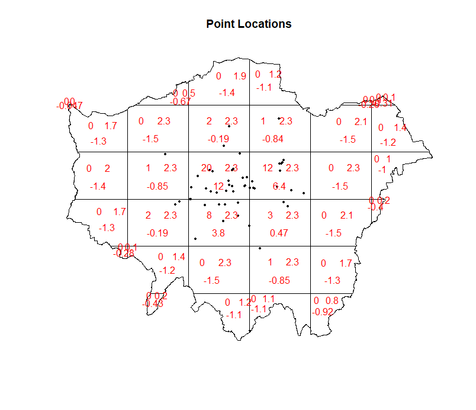

```
```{r echo=FALSE, fig.height=4, fig.width=3}
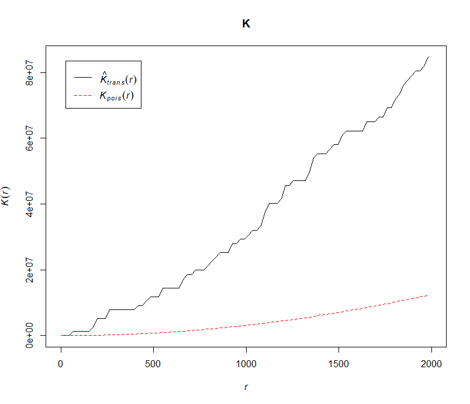

```
```{r echo=FALSE, fig.height=4, fig.width=3}
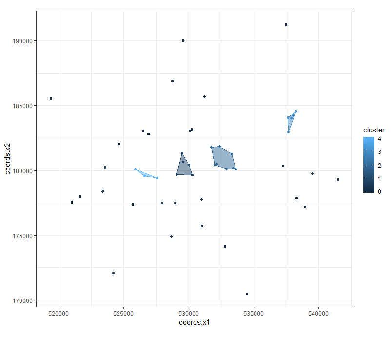

```
```{r echo=FALSE, fig.height=4, fig.width=3}
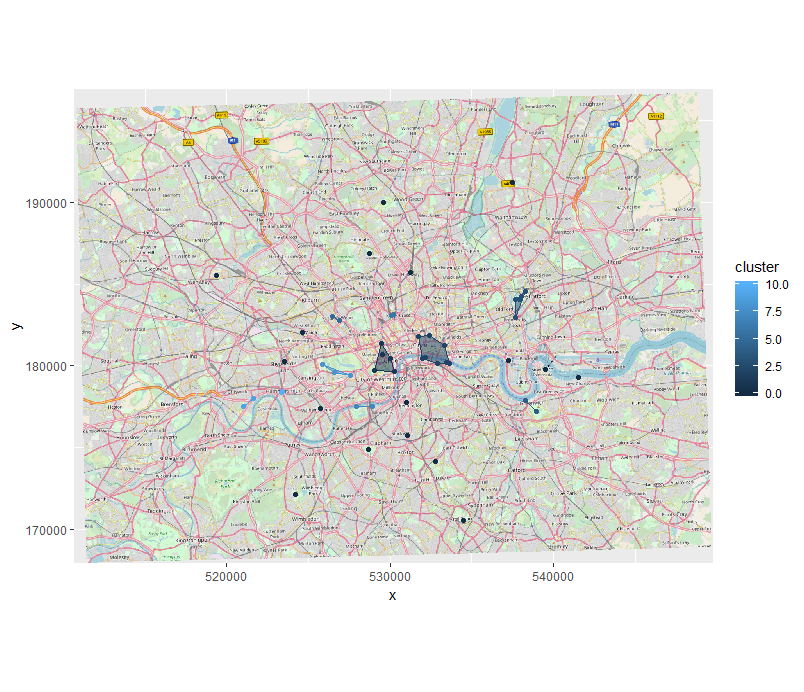

```
References
Ankerst, M., et al. (1999). OPTICS: Ordering Points To Identify the Clustering Structure. ACM SIGMOD International Conference on Management of Data. ACM Press, pp. 49-60. 
Ester, M., et al. (1996). A density-based algorithm for discovering clusters in large spatial	databases with noise. Proceedings of the Second International Conference on	Knowledge Discovery and Data, KDD-96, pp. 226-231.  
Kwan, M-P. (2012). The Uncertain Geographic Context Problem. Annals of the Association	of American Geographers, 102(5), pp. 958-968. 
Savvas, I.K., et al. (1967). A study of comparative clustering of EU countries using the	DBSCAN and k-means techniques within the theoretical framework of systemic	geopolitical analysis. International Journal of Grid and Utility Computing, 8(2), pp.	94-108. 
Ohser, J. (1983). On estimators for the reduced second moment measure of point processes.	Series Statistics, 14(1), pp. 63-71.
Ripley, B.D. (1977). Modelling Spatial Patterns. Journal of the Royal Statistical Society,	39(2), pp. 172-	212.


Part 3

Creating and Implementing an ArcGIS Tool to Calculate Herfindahl-Hirschman and Ellison-Glaeser Indices: A Case Study of Supermarkets in Greater London
Introduction
Market concentration indices are widely used to determine competition within a market for economic evaluations, business transactions, and antitrust calculations. The Herfindahl-Hirschman Index (HHI) is the most commonly used, as it measures firm-level concentration. However, a drawback of HHI is that it does not account for spatial concentration, and therefore discounts agglomeration effects. The Ellison-Glaeser Index (EGI) addresses this shortcoming by measuring market-level, location choice concentration, while accounting for HHI. 
After consulting literature on benefits, drawbacks and formulae of both indices, this paper will describe implementation of a proposed ArcGIS tool that calculates HHI and EGI. The tool’s workflow will be described through its implementation in calculating the two indices for supermarkets and groceries in Greater London. Ultimately, the tool’s functionality will be analyzed, improvements and extensions will be suggested, and the concentration of London’s groceries will be visualized.
1—Literature Review
1.1—Herfindahl-Hirschman Index
The HHI will be addressed first, as it is used within EGI’s calculations. It was theorized independently by A.O. Hirschman (1945) and O.C. Herfindahl (1950), thus explaining the hyphenated name (Board of Governors of the Federal Reserve System, 1993, p. 188). Hirschman used the index to examine international supply market concentration, while Herfindahl used it to analyze concentration in the U.S. steel industry (Hirschman, 1945; Herfindahl, 1950). Today, HHI is used in resource management, merger and acquisition evaluation, and technological landscape appraisal (Scholz and Wellmer, 2013, pp. 14-25; Cutler and Scott Morton, 2013, pp. 1964-1967; Liston-Heyes and Pilkington, 2004, p.18). The index is considered reliable enough that the U.S Federal Reserve uses it to analyze market concentrations and the U.S. Department of Justice uses it to address competition and antitrust cases (Board of Governors of the Federal Reserve System, 1993, p. 188; Department of Justice and the Federal Trade Commission, 2010, pp. 18-19). However, since HHI discounts markets’ and firms’ locations, it is aspatial. Its metric should be considered an estimation of market concentration that discounts spatiality.
To calculate HHI, a defined market, i, and the number of firms, N are required. Additionally, each firm, j, must have a share, z_j, of the market measure, say employment. Firms’ shares are squared and then summed, producing an HHI between zero and one (Auvray and Agha, 2018, p. 4). Unconcentrated markets have values below .15, highly concentrated markets have values .25 or above, while those in between are moderately concentrated. Below, H indicates the Herfindahl-Hirschman Index for the market area:
H=∑_(j=1)^N▒〖(z_j)〗^2 
1.2—Ellison-Glaeser Index
In 1994, Ellison and Glaeser developed their index to analyze geographic concentration in U.S. manufacturing (Ellison and Glaeser, 1994). While it is less popular than HHI, this index explicitly addresses spatiality by considering firms’ locations (Auvray and Agha, 2018, p. 4). However, the measure is not directly comparable to HHI, since it measures correlation of firms’ location decisions. It is mainly used by academics to examine agglomeration’s effects (Lu and Tao, 2009, p. 8; Lin et al., 2011, pp. 319-320; Yamamura and Goto, 2018, pp. 445-446).
	In the model, N firms and M submarkets are used to measure concentration of a market measure, say employment, for a market. Firms sequentially choose to locate among the submarkets. Firm j’s share of market employment is z_j. In submarket i, the industry’s share of total market employment is s_i, while x_i is the submarket’s share of total market employment:
γ=(∑_(i=1)^M▒〖〖(s_i-x_i)〗^2-(1-∑_(i=1)^M▒〖〖x_i〗^2)〗 ∑_(j=1)^N▒〖z_j〗^2 〗)/((1-∑_(i=1)^M▒〖〖x_i〗^2)(1-〗 ∑_(j=1)^N▒〖z_j〗^2 ))=(∑_(i=1)^M▒〖〖(s_i-x_i)〗^2-(1-∑_(i=1)^M▒〖〖x_i〗^2)〗 H〗)/((1-∑_(i=1)^M▒〖〖x_i〗^2)(1-〗 H))
where H is HHI for the market’s industry (Ellison and Glaeser, 1994, pp. 12-13). Product γ represents EGI. Positive results indicate correlation of location choices, while negative products denote diffusion of location choices. The proposed tool implements a simple EGI, whereas advanced versions account for agglomeration effects (Casey and Smith, 2014, pp.3-5). 
1.3—Issues with Herfindahl-Hirschman and Ellison-Glaeser
Regardless of spatiality, the modifiable areal unit problem (MAUP) affects both indices. MAUP results from areal unit choice and implies that results for units with differing scales or shapes are inconsistent (Jelinski and Wu, 1996, p. 130). Additionally, the checkboard problem impacts EGI, as a result of it discounting areal unit adjacency. This limits identification of agglomerations and spillovers to the areal unit itself (Vignandi et al., 2016, p. 303). Regardless of these problems, HHI and EGI are considered viable methods of estimating concentration, but more robust indices have been developed and will be suggested in section 4.2. 
1.4—Comparison of HHI and EGI
While both indices measure market concentration, their indications differ. HHI illustrates competition within an industry, whereas EGI indicates correlation among firms’ location decisions (Naude, 2006, pp.6-7). Therefore, HHI and EGI should be considered together when analyzing industrial concentration, but they are not directly comparable.  
2—Motivation and Implementation of the Proposed Tool
2.1—Motivation 
A concentration index tool for geographic information systems (GIS) would serve a wide audience, primarily for the reasons outlined above. It would allow users to quickly calculate and visualize both spatial and aspatial indices. Considering Esri maintained near monopoly of the GIS market in 2015, any tool should be tailored to ArcGIS (Esri, 2015). The following sections briefly explore the proposed tool’s parameters, workflow, and implementation for major Greater London groceries’ employment—the metric of study.  
2.2—Parameters 
Implementation requires three feature classes (FCs), seven fields (as strings), and one output geodatabase. FCs denote markets (polygon), submarkets of the markets (polygon), and firms (point). Greater London’s boroughs and wards will be considered markets and submarkets, respectively, in this example. Firms are groceries. The markets FC contains fields identifying markets and their employment. The submarkets FC contains fields identifying the submarket, its market, and its share of employment. The firms FC should contain fields denoting firms and their employment. In the example, boroughs and wards will be identified by their names and GSS Code, respectively. The output geodatabase is populated by tool processes. 
2.3—Workflow 
In Figure 1, dark blue nodes indicate input FCs or geodatabases, celeste nodes represent fields input as strings, gold nodes indicate processes, and green nodes denote FCs or tables generated by processes. Connectors show the workflow’s direction. Numbers indicate order of processes. For clarity, Table A lists processes’ numbers, titles, and corresponding PyScripts.

Figure 1—Workflow of the Proposed Tool
```{r echo=FALSE, fig.height=4, fig.width=3}
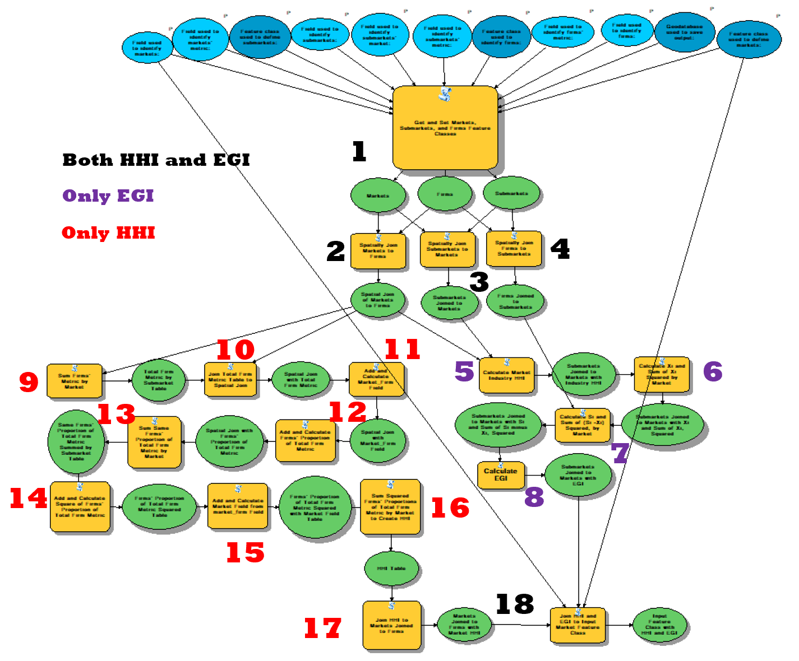

```


```{r echo=FALSE, fig.height=4, fig.width=3}
knitr::include_graphics("12.png")

```


2.5—Example Data: London Groceries
Locations for London groceries were obtained from Geolytix (2018). Rough estimates of average employment per store, per firm, were compiled (See groceryMarket.xlsx for details). Wards, boroughs, and employment data were produced by London Datastore (2015; 2018). City of London and Hackney are omitted due to insufficient data. 
2.4—Implementation 
The user runs the tool by double-clicking the “Calculate HHI and EGI” model inside the Concentration toolbox, inputs required FCs and fields, and clicks “OK”. For the purpose of this paper, the model has been saved with the required fields and FCs from the London groceries example; however, input can be altered for other analyses. To avoid overwriting input FCs, the model initially duplicates them as markets, submarkets, and firms in the output geodatabase (1). From fields input as strings: markets contain markets and marketMetric; submarkets contain submarkets, submarketMarket, and submarketMetric; and firms contain firm and firmMetric. Beside joining indices to the input markets FC, subsequent processes and outputs occur in the output geodatabase. Following duplication, three FCs are created: markets are spatially joined to firms (marketsJoinedToFirms) (2), submarkets are spatially joined to markets (submarketsJoinedToMarkets) (3), and firms are spatially joined to submarkets (firmsJoinedToSubmarkets) (4). 
For EGI, marketsJoinedToFirms and submarketsJoinedToMarkets are used to calculate industry HHIs for markets’ firms by summing firms’ employments, by firm, by market. Proportions of firms’ employment to markets’ industry employment are then calculated and squared. The sums of squares represent HHIs for the industry, and are joined to submarketsJoinedToMarkets, by market (5). Next, submarketsJoinedToMarkets is used to calculate proportions of submarkets’ employment, relative to the total market, x_i. These are then squared, and summed, by market, giving ∑_(i=1)^M▒〖x_i〗^2 . These figures are rejoined to submarketsJoinedToMarkets (6). Subsequently, submarketsJoinedToMarkets and firmsJoinedToSubmarkets are used to calculate proportions of submarkets’ industry employment relative to market industry employment, s_i. Next, x_i is subtracted from s_i. The differences are squared and then summed, giving ∑_(i=1)^M▒〖(s_i-x_i)〗^2 . These values are rejoined to submarketsJoinedToMarkets, by market (7). The submarketsJoinedToMarkets FC is then used to compute EGI, by market (8).
For HHI, sums of firms’ employments, by market, are first calculated with marketsJoinedToFirms (9). The resulting table’s sums are rejoined to marketsJoinedToFirms by market (10). Next, a concatenated market_firm field is calculated from market and firm fields so firmMetric can be summed by both firm and market in process 13 (11). Proportions of firm to market employment are then calculated (12). To account for firms with multiple locations, proportions are summed by market_firm (13). These sums are squared (14) and a market field is derived from market_firm (15). Squared sums are then summed, by market, to produce market HHIs (16), which are joined to the submarketsJoinedToMarkets FC (17). 
Finally, HHIs and EGIs are joined to the input markets feature class (18), allowing the user to visualize results however she would like. There are notably fewer nodes for EGI than HHI because EGI’s contain more robust code. Code for EGI’s processes is shown in the Technical Appendix, while the rest can be found in the accompanying folder.  


3—Results
Table B in the Appendix shows exact HHIs and EGIs for each of the 31 boroughs modelled.
Choropleth of Greater London Boroughs, by Grocery Herfindahl-Hirschman Index
```{r echo=FALSE, fig.height=4, fig.width=3}
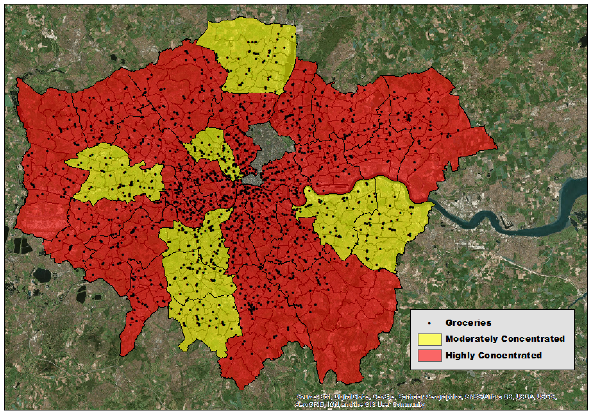

```
Choropleth of Greater London Boroughs, by Grocery Ellison-Glaeser Index
```{r echo=FALSE, fig.height=4, fig.width=3}
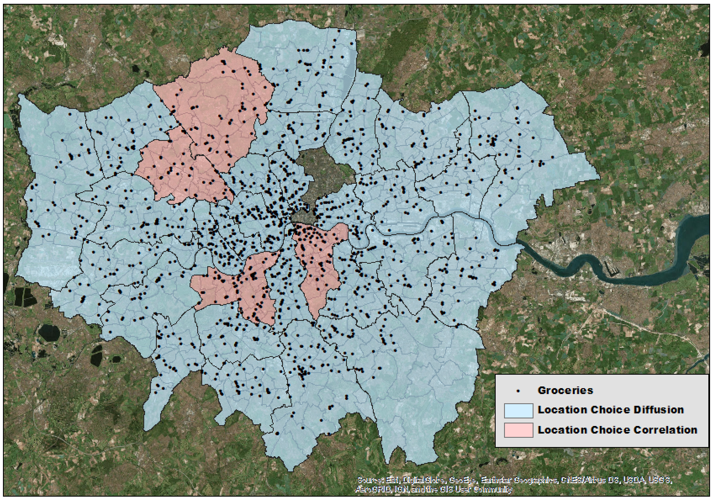

```


4—Discussion
4.3—London Groceries Example
The tool appears to accurately predict firm-level concentration with HHI; however, MAUP seriously affects EGI via ward size variation. This compounds with a lack of groceries in certain wards to bias estimates. For instance, there are (supposedly) no groceries in seven of Bromley’s twenty-two wards. As a result, Bromley has the greatest choice diffusion of any borough. Complete data and use of uniform submarket sizes, such as a quadrat grid, would undoubtedly strengthen analyses. Likewise, implementation of better-suited indices would address issues caused by MAUP and the checkerboard problem.
Grocery Distribution among Bromley’s Wards
```{r echo=FALSE, fig.height=4, fig.width=3}
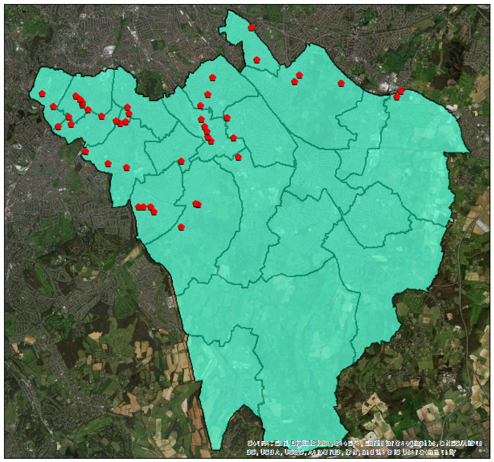

```
4.1—Proposed Improvements for Tool’s Underlying Code
While the tool calculates HHI and EGI, use of functions in underlying code would decrease run-time and increase code legibility. PyScripts should also address corner cases, as certain input would likely “break” the tool. Improving validation procedures would allow users to select fields instead of inputting them as strings. Improvements would also allow model parameters to recognize visualized layers or FCs, providing the option of selecting from populated dropdown menus. Most importantly, HHI’s PyScripts can be consolidated, so its branch more closely resembles EGI’s. Finally, the tool should allow the user to select which indices are calculated. This selection would decrease run-time and improve user experience. Ultimately, these improvements would result in a more presentable workflow and a more robust, quicker tool.
4.2—Proposed Improvements for Tool’s Analytical Capacity
Even though using HHI and EGI in conjunction provides sufficient estimation of concentration, more robust indices exist, namely the Maurel-Sedillot, Guimarães, Marcon-Peuch, and Duranton-Overman indices (Maurel and Sédillot, 1999; Guimarães et al., 2011; Marcon and Peuch, 2014; Duranton and Overman, 2005). While MAUP affects HHI and EGI, some of these indices address this issue, as well as the checkerboard problem. Implementing Maurel-Sédillot could directly address the issues affecting Bromley, in that it does not account for submarket variations (Auvray-Agha, 2018, p. 5). Guimarães goes a step further by spatially-weighting Ellison-Glaeser and Maurel-Sédillot indices to addresses the checkerboard problem that affects both (Guimarães et al., 2011).
While Ellison-Glaeser and Maurel- Sédillot are applicable for discrete submarkets and markets, Marcon-Peuch and Duranton-Overman are continuous and account for interactions between zones. Because of this, the MAUP and checkerboard issues are not a problem. Furthermore, Marcon-Peuch examines absolute concentration of a sector and denotes an industries concentration across the market, while Duranton-Overman produces a relative measure that assigns greater weight to the industry’s overall presence in the market (Auvray-Agha, 2018, pp. 3-6). While these indices all estimate concentration, they do so over different scales, address different problems, and report different concentration measures. Therefore, any exhaustive concentration tool should allow the user to choose from possible indices, so that she can calculate those that best suit her situation. 
5—Conclusion
The proposed tool simplifies HHI and EGI analysis, but, with the suggested improvements and extensions, it would be indispensable for analyzing market concentrations. This endeavour has also demonstrated that, on average, London groceries are concentrated at firm-level, but their decisions of where to locate are not correlated. Subsequent research should examine how use of a quadrat grid for defining submarkets, instead of wards, impacts EGI measures. Furthermore, investigations should determine if consumers are benefitting from firm-level concentration or if antitrust action is warranted. 


References
Auvray, E. and Agha, S.B. (2018). “Measuring geographic concentration of economic	activities”. 67th Annual Meeting of the French Economic Association. Available at:	https://afse2018.sciencesconf.org/190823/document 
Board of Governors of the Federal Reserve System. (1993). “The Herfindahl-Hirschman	Index”. Federal Reserve Bank of St. Louis. Available at: https://fraser.stlouisfed		.org/files/docs/publications/FRB/pages/1990-1994/33101_1990-1994.pdf
Casey, A.J. and Smith, B.O. (2014). “Simulating confidence for the Ellison-Glaeser index”.	Journal of Urban Economics, 81, pp. 85-103. 
Cutler, D.M. and Scott Morton, F. (2013). “Hospitals, market share, and consolidation”.	Journal of the American Medical Association, 310(18), pp. 1964-70. 
Department of Justice and the Federal Trade Commission. (2010). “Horizontal Merger	Guidelines”. Department of Justice and the Federal Trade Commission. Available at:	https://www.justice.gov/sites/default/files/atr/legacy/2010/08/19/hmg-2010.pdf
Duranton, G. and Overman, H.G. (2005). “Testing for localization using micro-geographic	data”. The Review of Economic Studies, 72(4), pp. 1077–1106.
Ellison, G. and Glaeser, E. (1994). “Geographic Concentration in U.S. Manufacturing	Industries: A Dartboard Approach”. NBER Working Papers, No. 4840. Available at:	https://www.nber.org/papers/w4840
Esri. (2015). “Independent Report Highlights Esri as Leader in Global GIS Market”.	esri.com. Available at: https://www.esri.com/esri-news/releases/15-1qtr/independent-	report-highlights-esri-as-leader-in-global-gis-market [Accessed 30 December, 2018].
Geolytix. (2018). “Retail Points: Supermarkets”. Geolytix. https://blog.geolytix.net/2018/10	/23/4years-of-retail-points/ [Accessed 26 December, 2018].
Guimarães et al. (2011). “Accounting for Neighboring Effects in Measures of Spatial	Concentration”. Journal of Regional Science, 51(4), pp. 678-693. 
Herfindahl, O.C. (1950). “Concentration in the U.S. Steel Industry”. Columbia University,	Doctorate Dissertation. 
Hirschman, A.O. (1945). National Power and the Structure of Foreign Trade. University of	California: Berkeley and Los Angeles. 
Jelinski, D.E. and Wu, J. (1996) “The modifiable areal unit problem and implications for	landscape ecology” Landscape Ecology, 11(3), pp. 129-140. 
Lin et al. (2011). “Agglomeration and productivity: Firm-level evidence from China’s textile	industry”. China Economic Review, 22(3), pp. 313-329. 
Liston-Heyes, C and Pilkington A. (2004). “Inventive concentration in the production of	green technology: A comparative analysis of fuel cell patents”. Science and Public	Policy, 31(1), pp. 15-25.
London Datastore. (2015). “Ward Profiles and Atlases”. London Datastore.	https://data.london.gov.uk/dataset /ward-profiles-and-atlas [Accessed 26 December	2018].
London Datastore. (2018). “Statistical GIS Boundary Files for London: London Wards	2014”. London Datastore. https://data.london.gov.uk/dataset/statistical-gis-boundary-	files-london [Accessed 26 December, 2018].
Lu, J. and Tao, X. (2007). “Trends and Determinants of China’s Industrial Agglomeration”.	Munich Personal RePEc Archive, No. 6597. Available at: https://mpra.ub.uni-	muenchen.de/6597/1/MPRA_paper_6597.pdf
Marcon, E. and Puech, F. (2014). “Mesures de la concentration spatiale en espace continue:	théorie et applications”. Economie et statistique, 474(1), pp. 105–131.
Maurel, F. and Sédillot, B. (1999) “A measure of the geographic concentration in French	manufacturing industries”. Regional Science and Urban Economics, 29(5), pp. 575	604.
Naude, C. (2006) “Measures of Manufacturing Industry Concentration – Implications for	South Africa”. Development Policy Research Unit Conference, 2006. Available at:	http://citeseerx.ist.psu.edu/viewdoc/download?doi=10.1.1.485.3140&rep=rep1&type=	pdf
Scholz, R.W. and Wellmer, F.W. (2013). “Approaching a dynamic view on the availability of	mineral resources: What we may learn from the case of phosphorus?”. Global	Environmental Change-Human and Policy Dimensions, 23(1), pp. 11-27. 
Vignandi et al. (2016). “Measures of Industry Agglomeration in Brazil: a Study Addressing	Neighboring Effects” Análise Econômica, 34(65), pp. 301-332.
Yamamura, S. and Goto, H. (2018). “Location patterns and determinants of knowledge	intensive industries in the Tokyo Metropolitan Area”. Japan Architectural Review,	1(4), pp. 443-456.
Appendix
```{r echo=FALSE, fig.height=4, fig.width=3}
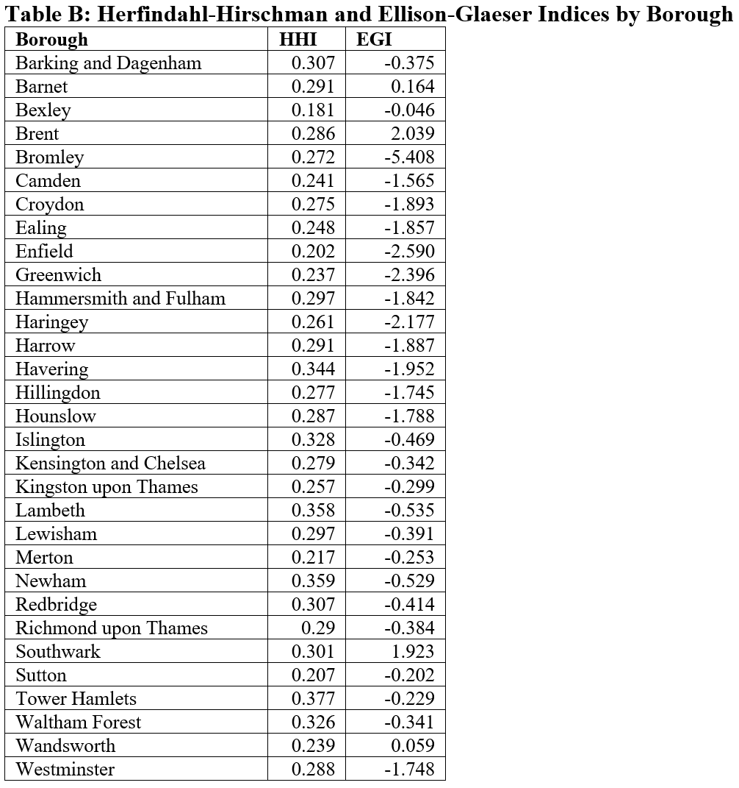

```


Technical Appendix
Process 5—Calculate Market Industry HHI
#-------------------------------------------------------------------------------
# Name:        calcMarketIndustryHHI
#
# Purpose:     calculate industry HHI for a market
#
#              Use markets joined to firms to sum firm metric by firm, by
#              market-firm metric;
#              Use markets joined to firms to sum firm metric by market-
#              market industry metic;
#              Join market industry metric to the table resulting from the sum
#              of firm metric by firm, by market;
#              Calculate the proportion of firm metric to market industry
#              metric - Zj;
#              Calculate the square of Zj;
#              Sum Zj squared, by market - market industry HHI;
#              Join market industry HHI to submarkets to markets spatial join;
#
# Author:      Matthew Sutton
#
# Created:     29/12/2018
#-------------------------------------------------------------------------------
import arcpy

#get and set marketsJoinedToFirms, markets, and submarkets
marketsJoinedToFirms = arcpy.GetParameterAsText(0)
submarketsToMarketsJoin = arcpy.GetParameterAsText(1)
###############################################################################
###############################################################################
###############################################################################
#Use markets joined to firms to sum firm metic by firm by market-firm
#metic;
#get path from marketsJoinedToFirms and create output table path in its
#geodatabase
marketsJoinedToFirmsPath = [marketsJoinedToFirms]
wantedPathList = marketsJoinedToFirmsPath[0].split('\\')
wantedPathList.pop(-1)
path = wantedPathList[0]
index = 1
while index < len(wantedPathList):
    path = path + "\\" + wantedPathList[index]
    index = index + 1
sumFirmMetricByFirmByMarketPath = str(path) + "\\sumFirmMetricByFirmByMarket"

#delete sumFirmMetricByFirmByMarket table if it already exists
if arcpy.Exists(sumFirmMetricByFirmByMarketPath):
    arcpy.Delete_management(sumFirmMetricByFirmByMarketPath)

#sum firms' metric by firm by market
arcpy.Statistics_analysis   (marketsJoinedToFirms,
                            sumFirmMetricByFirmByMarketPath,
                            [["firmMetric", "SUM"]],
                            ["firm","market"])

#rename summed metric field
arcpy.AlterField_management (sumFirmMetricByFirmByMarketPath,
                            "SUM_firmMetric",
                            "firmMetricByFirmByMarket",
                            "firmMetricByFirmByMarket")
###############################################################################
###############################################################################
###############################################################################
#Use markets joined to firms to sum firm metric by market - market industry
#metric;
#set table name
sumFirmMetricByMarketPath = str(path) + "\\sumFirmMetricByMarket"

#delete sumFirmMetricByMarket table if it already exists
if arcpy.Exists(sumFirmMetricByMarketPath):
    arcpy.Delete_management(sumFirmMetricByMarketPath)

#sum firms' metric by market
arcpy.Statistics_analysis   (marketsJoinedToFirms,
                            sumFirmMetricByMarketPath,
                            [["firmMetric", "SUM"]],
                            ["market"])

#rename summed metric field
arcpy.AlterField_management (sumFirmMetricByMarketPath,
                            "SUM_firmMetric",
                            "firmMetricByMarket",
                            "firmMetricByMarket")
###############################################################################
###############################################################################
###############################################################################
#Join market industry metric to firmMetricByFirmByMarket table by market

#delete firmMetricByFirmByMarket field if it exists in marketsJoinedToFirms
if len(arcpy.ListFields(sumFirmMetricByFirmByMarketPath, "firmMetricByMarket")) > 0:
    arcpy.DeleteField_management(sumFirmMetricByFirmByMarketPath,["firmMetricByMarket"])


#join the firmMetricByMarket to sumFirmMetricByFirmByMarket table by market
arcpy.JoinField_management  (sumFirmMetricByFirmByMarketPath,
                            "market",
                            sumFirmMetricByMarketPath,
                            "market",
                            ["firmMetricByMarket"])
###############################################################################
###############################################################################
###############################################################################
#Calculate the proportion of firm metric to market industry metric - Zj;
#add Zj field to sumFirmMetricByFirmByMarket table
arcpy.AddField_management   (sumFirmMetricByFirmByMarketPath,
                            "Zj",
                            "FLOAT",
                            15,
                            14)

#set to calculate proportion of firm metric to total market industry metric
calculateProp = "!firmMetricByFirmByMarket!/!firmMetricByMarket!"

#calculate Zj
arcpy.CalculateField_management (sumFirmMetricByFirmByMarketPath,
                                "Zj",
                                calculateProp,
                                "PYTHON_9.3")
###############################################################################
###############################################################################
###############################################################################
#Calculate the square of Zj;
#add ZjSquared field to sumFirmMetricByFirmByMarket table
arcpy.AddField_management   (sumFirmMetricByFirmByMarketPath,
                            "ZjSquared",
                            "FLOAT",
                            15,
                            14)

#set to calculate square of Zj
calculateSquare = "!Zj!*!Zj!"

#calculate square of Zj
arcpy.CalculateField_management (sumFirmMetricByFirmByMarketPath,
                                "ZjSquared",
                                calculateSquare,
                                "PYTHON_9.3")
###############################################################################
###############################################################################
###############################################################################
#Sum Zj squared, by market - market industry HHI;
#set table name
marketIndustryHHIPath = str(path) + "\\marketIndustryHHI"

#delete marketIndustryHHI table if it already exists
if arcpy.Exists(marketIndustryHHIPath):
    arcpy.Delete_management(marketIndustryHHIPath)

#sum firms' metric by market
arcpy.Statistics_analysis   (sumFirmMetricByFirmByMarketPath,
                            marketIndustryHHIPath,
                            [["ZjSquared", "SUM"]],
                            ["market"])

#rename summed metric field
arcpy.AlterField_management (marketIndustryHHIPath,
                            "SUM_ZjSquared",
                            "marketIndustryHHI",
                            "marketIndustryHHI")
###############################################################################
###############################################################################
###############################################################################
#Join market industry HHI to submarkets to markets spatial join;
#delete firmMetricByFirmByMarket field if it exists in marketsJoinedToFirms
if len(arcpy.ListFields(submarketsToMarketsJoin, "marketIndustryHHI")) > 0:
    arcpy.DeleteField_management(submarketsToMarketsJoin,["marketIndustryHHI"])


#join marketIndustryHHI to submarketsToMarketsJoin by market
arcpy.JoinField_management  (submarketsToMarketsJoin,
                            "market",
                            marketIndustryHHIPath,
                            "market",
                            ["marketIndustryHHI"])

arcpy.SetParameterAsText(2,submarketsToMarketsJoin)

Process 6—Calculate Xi and Sum of Xi Squared by Market
#-------------------------------------------------------------------------------
# Name:        calcXiAndSumOfXiSquaredByMarket
# Purpose:     Calculate Xi:
#
#              Calculate the proportion of total submarket metric to total
#              market metric - Xi;
#              Calculate the square of Xi - Xi squared;
#              Sum squared Xi by market;
#              Rejoin sum of square Xi's to spatial join of submarkets to
#              markets by market
#
# Author:      Matthew Sutton
#
# Created:     29/12/2018
#-------------------------------------------------------------------------------
import arcpy

#get and set submarketsJoinedToMarkets
submarketsJoinedToMarkets = arcpy.GetParameterAsText(0)
###############################################################################
###############################################################################
###############################################################################
#Use spatial join of submarkets to markets to sum submarkets' metric by market,
#producing total submarket metric;
#get path from submarketsJoinedToMarkets and create output table path in its
#geodatabase
submarketsJoinedToMarketsPath = [submarketsJoinedToMarkets]
wantedPathList = submarketsJoinedToMarketsPath[0].split('\\')
wantedPathList.pop(-1)
path = wantedPathList[0]
index = 1
while index < len(wantedPathList):
    path = path + "\\" + wantedPathList[index]
    index = index + 1
###############################################################################
###############################################################################
###############################################################################
#Calculate the proportion of submarket metric to market metric - Xi;
#delete Xi field if it exists in submarketsJoinedToMarkets
if len(arcpy.ListFields(submarketsJoinedToMarkets, "Xi")) > 0:
    arcpy.DeleteField_management(submarketsJoinedToMarkets,["Xi"])

#add Xi field to submarketsJoinedToMarkets
arcpy.AddField_management   (submarketsJoinedToMarkets,
                            "Xi",
                            "FLOAT",
                            5,
                            4)

#set to calculate proportion of total submarket metric to total market metric
calculateProp = "float(!submarketMetric!)/!marketMetric!"

#calculate Xi
arcpy.CalculateField_management (submarketsJoinedToMarkets,
                                "Xi",
                                calculateProp,
                                "PYTHON_9.3")
###############################################################################
###############################################################################
###############################################################################
#Calculate the square of Xi - Xi squared;
#delete XiSquared field if it exists in submarketsJoinedToMarkets
if len(arcpy.ListFields(submarketsJoinedToMarkets, "XiSquared")) > 0:
    arcpy.DeleteField_management(submarketsJoinedToMarkets,["XiSquared"])

#add XiSquared field to submarketsJoinedToMarkets
arcpy.AddField_management   (submarketsJoinedToMarkets,
                            "XiSquared",
                            "FLOAT",
                            15,
                            14)

#set to calculate square of Xi
calculateSquare = "!Xi!*!Xi!"

#calculate square of Xi
arcpy.CalculateField_management (submarketsJoinedToMarkets,
                                "XiSquared",
                                calculateSquare,
                                "PYTHON_9.3")
###############################################################################
###############################################################################
###############################################################################
#Sum squared Xi by market;
#set table name
sumXiSquaredByMarketPath = str(path) + "\\sumXiSquaredByMarket"

#delete sumXiSquaredByMarket table if it already exists
if arcpy.Exists(sumXiSquaredByMarketPath):
    arcpy.Delete_management(sumXiSquaredByMarketPath)

#sum firms' metric by market
arcpy.Statistics_analysis   (submarketsJoinedToMarkets,
                            sumXiSquaredByMarketPath,
                            [["XiSquared", "SUM"]],
                            ["market"])

#rename summed metric field
arcpy.AlterField_management (sumXiSquaredByMarketPath,
                            "SUM_XiSquared",
                            "sumXiSquaredByMarket",
                            "sumXiSquaredByMarket")
###############################################################################
###############################################################################
###############################################################################
#Rejoin sum of square Xi's to spatial join of submarkets to markets by market;
#delete sumXiSquaredByMarket field if it exists in submarketsJoinedToMarkets
if len(arcpy.ListFields(submarketsJoinedToMarkets, "sumXiSquaredByMarket")) > 0:
    arcpy.DeleteField_management(submarketsJoinedToMarkets,["sumXiSquaredByMarket"])


#join the sumXiSquaredByMarket to submarketsJoinedToMarkets by market
arcpy.JoinField_management  (submarketsJoinedToMarkets,
                            "market",
                            sumXiSquaredByMarketPath,
                            "market",
                            ["sumXiSquaredByMarket"])
###############################################################################
###############################################################################
###############################################################################
arcpy.SetParameterAsText(1,submarketsJoinedToMarkets)
Process 7—Calculate Si and Sum of (Si -Xi) Squared, by Market
#-------------------------------------------------------------------------------
# Name:        calcSiAndSumOfSiMinusXiSquaredByMarket
# Purpose:     Calculate Si:
#
#              Use firms joined to submarkets to sum firm metric by submarket;
#              Use firms joined to submarkets to sum firm metric by
#              submarketMarket;
#              Rejoin firm metric summed by submarket and firm metric summed by
#              submarketMarketto submarkets-markets spatial join, using
#              submarket, making sure that null values are then converted to
#              zeroes;
#              Calculate the proportion of firmMetricBySubmarket to
#              firmMetricBySubmarketMarket - Si;
#              Subtract Xi from Si and square the result;
#              Sum square (Si - Xi) by market and rejoin the result to submarket
#              -market join by market;
#
# Author:      Matthew Sutton
#
# Created:     29/12/2018
#-------------------------------------------------------------------------------
import arcpy

#get and set firms and submarkets
submarketsJoinedToMarkets = arcpy.GetParameterAsText(0)
firmsJoinedToSubmarkets = arcpy.GetParameterAsText(1)
###############################################################################
###############################################################################
###############################################################################
#get path from submarketsJoinedToMarkets and create output table path in its
#geodatabase
submarketsJoinedToMarketsPath = [submarketsJoinedToMarkets]
wantedPathList = submarketsJoinedToMarketsPath[0].split('\\')
wantedPathList.pop(-1)
path = wantedPathList[0]
index = 1
while index < len(wantedPathList):
    path = path + "\\" + wantedPathList[index]
    index = index + 1
###############################################################################
###############################################################################
###############################################################################
#Use firms joined to submarkets to sum firm metric by submarket;
#set table name
sumFirmMetricBySubmarketPath = str(path) + "\\sumFirmMetricBySubmarket"

#delete sumFirmMetricBySubmarket table if it already exists
if arcpy.Exists(sumFirmMetricBySubmarketPath):
    arcpy.Delete_management(sumFirmMetricBySubmarketPath)

#sum firms' metric by submarket
arcpy.Statistics_analysis   (firmsJoinedToSubmarkets,
                            sumFirmMetricBySubmarketPath,
                            [["firmMetric", "SUM"]],
                            ["submarket"])

#rename summed metric field
arcpy.AlterField_management (sumFirmMetricBySubmarketPath,
                            "SUM_firmMetric",
                            "firmMetricBySubmarket",
                            "firmMetricBySubmarket")
###############################################################################
###############################################################################
###############################################################################
#Use firms joined to submarkets to sum firm metric by submarketMarket;
#set table name
sumFirmMetricBySubmarketMarketPath = str(path) + "\\sumFirmMetricBySubmarketMarket"

#delete sumFirmMetricMarket table if it already exists
if arcpy.Exists(sumFirmMetricBySubmarketMarketPath):
    arcpy.Delete_management(sumFirmMetricBySubmarketMarketPath)

#sum firms' metric by submarketMarket
arcpy.Statistics_analysis   (firmsJoinedToSubmarkets,
                            sumFirmMetricBySubmarketMarketPath,
                            [["firmMetric", "SUM"]],
                            ["submarketMarket"])

##rename summed metric field
arcpy.AlterField_management (sumFirmMetricBySubmarketMarketPath,
                           "SUM_firmMetric",
                           "firmMetricByMarket",
                           "firmMetricByMarket")

###############################################################################
###############################################################################
###############################################################################
#Rejoin firm metric summed by submarket to submarketsJoinedToMarkets,
#using submarket;
#delete firmMetricBySubmarket & firmMetricBySubmarketMarket fields if they exist
#in submarketsJoinedToMarkets
if len(arcpy.ListFields(submarketsJoinedToMarkets, "firmMetricByMarket")) > 0:
    arcpy.DeleteField_management(submarketsJoinedToMarkets,["firmMetricByMarket"])
if len(arcpy.ListFields(submarketsJoinedToMarkets, "firmMetricByMarket")) > 0:
    arcpy.DeleteField_management(submarketsJoinedToMarkets,["firmMetricByMarket"])


#join firmMetricBySubmarket and firmMetricBySubmarketMarket to
#submarketsJoinedToMarkets by submarket
arcpy.JoinField_management  (submarketsJoinedToMarkets,
                            "submarket",
                            sumFirmMetricBySubmarketPath,
                            "submarket",
                            ["firmMetricBySubmarket"])


#change null values to zeroes
with arcpy.da.UpdateCursor  (submarketsJoinedToMarkets,
                            ["firmMetricBySubmarket"]) as row:
    for obs in row:
        if obs[0] == None:
            obs[0] = 0
            row.updateRow(obs)
arcpy.JoinField_management  (submarketsJoinedToMarkets,
                            "submarketMarket",
                            sumFirmMetricBySubmarketMarketPath,
                            "submarketMarket",
                            ["firmMetricByMarket"])
#change null values to zeroes
with arcpy.da.UpdateCursor  (submarketsJoinedToMarkets,
                            ["firmMetricByMarket"]) as row:
    for obs in row:
        if obs[0] == None:
            obs[0] = 0
            row.updateRow(obs)
###############################################################################
###############################################################################
###############################################################################
#Calculate the proportion of firmMetricBySubmarket to submarketMetric- Si;
#delete new field if it already exists
if len(arcpy.ListFields(submarketsJoinedToMarkets, "Si")) > 0:
    arcpy.DeleteField_management(submarketsJoinedToMarkets,["Si"])

#add Si to submarketsJoinedToMarkets
arcpy.AddField_management   (submarketsJoinedToMarkets,
                            "Si",
                            "DOUBLE",
                            15,
                            14)

#set calculation to Si
calculateProp = "!firmMetricBySubmarket!/!firmMetricByMarket!"

#calculate proportion of firmMetricBySubmarket to submarketMetric(Si)
arcpy.CalculateField_management (submarketsJoinedToMarkets,
                                "Si",
                                calculateProp,
                                "PYTHON_9.3")
###############################################################################
###############################################################################
###############################################################################
#Subtract Xi from Si and square the result;
#delete new field if it already exists
if len(arcpy.ListFields(submarketsJoinedToMarkets, "SiMinusXiSquared")) > 0:
    arcpy.DeleteField_management(submarketsJoinedToMarkets,["SiMinusXiSquared"])

#add Si to submarketsJoinedToMarkets
arcpy.AddField_management   (submarketsJoinedToMarkets,
                            "SiMinusXiSquared",
                            "DOUBLE",
                            15,
                            14)

#set calculation to square difference of Si and Xi
calculateSqOfDiff = "(!Si!-!Xi!)*(!Si!-!Xi!)"

#calculate square difference of Si and Xi - (Si - Xi)squared
arcpy.CalculateField_management (submarketsJoinedToMarkets,
                                "SiMinusXiSquared",
                                calculateSqOfDiff,
                                "PYTHON_9.3")
###############################################################################
###############################################################################
###############################################################################
#Sum square (Si - Xi) by market and rejoin the result to submarket-market join
#by market;
#set table name
sumSiMinusXiSquaredByMarketPath = str(path) + "\\sumSiMinusXiSquaredByMarket"

#delete sumSiMinusXiSquaredByMarket table if it already exists
if arcpy.Exists(sumSiMinusXiSquaredByMarketPath):
    arcpy.Delete_management(sumSiMinusXiSquaredByMarketPath)

#sum SiMinusXiSquared by market
arcpy.Statistics_analysis   (submarketsJoinedToMarkets,
                            sumSiMinusXiSquaredByMarketPath,
                            [["SiMinusXiSquared", "SUM"]],
                            ["market"])

#rename summed metric field
arcpy.AlterField_management (sumSiMinusXiSquaredByMarketPath,
                            "SUM_SiMinusXiSquared",
                            "sumSiMinusXiSquared",
                            "sumSiMinusXiSquared")

#delete sumSiMinusXiSquared field if it exists in submarketsJoinedToMarkets
if len(arcpy.ListFields(submarketsJoinedToMarkets, "sumSiMinusXiSquared")) > 0:
    arcpy.DeleteField_management(submarketsJoinedToMarkets,["sumSiMinusXiSquared"])


#join the sumSiMinusXiSquared to submarketsJoinedToMarkets by market
arcpy.JoinField_management  (submarketsJoinedToMarkets,
                            "market",
                            sumSiMinusXiSquaredByMarketPath,
                            "market",
                            ["sumSiMinusXiSquared"])
###############################################################################
###############################################################################
###############################################################################
arcpy.SetParameterAsText(2,submarketsJoinedToMarkets)

Process 8—Calculate EGI
#-------------------------------------------------------------------------------
# Name:        calcEGI
#
# Purpose:     calculate EGI for markets:
#
#              calculate EGI for markets:
#                   ( sumSiMinusXiSquared
#                       minus
#                   ( (1 minus sumXiSquaredByMarket)
#                       times
#                   marketIndustryHHI) ) )
#                       divided by
#                   ( (1 minus sumXiSquaredByMarket)
#                       times
#                   (1 minus marketIndustryHHI) );
#              join EGI to input markets FC;
#
#
# Author:      Matthew Sutton
#
# Created:     30/12/2018
#-------------------------------------------------------------------------------
import arcpy

#get and set submarkets-markets join
submarketsJoinedToMarkets = arcpy.GetParameterAsText(0)
###############################################################################
###############################################################################
###############################################################################
#calculate EGI for markets:
#                   ( sumSiMinusXiSquared
#                       minus
#                   ( (1 minus sumXiSquaredByMarket)
#                       times
#                   marketIndustryHHI) ) )
#                       divided by
#                   ( (1 minus sumXiSquaredByMarket)
#                       times
#                   (1 minus marketIndustryHHI) );
#delete new field if it already exists
if len(arcpy.ListFields(submarketsJoinedToMarkets, "EGI")) > 0:
    arcpy.DeleteField_management(submarketsJoinedToMarkets,["EGI"])

#add EGI to submarketsJoinedToMarkets
arcpy.AddField_management   (submarketsJoinedToMarkets,
                            "EGI",
                            "FLOAT",
                            15,
                            14)

#set calculation to EGI
calculateEGI = "(!sumSiMinusXiSquared!-((1-!sumXiSquaredByMarket!)*!marketIndustryHHI!))/((1-!sumXiSquaredByMarket!)*(1-!marketIndustryHHI!))"

#calculate markets' EGI
arcpy.CalculateField_management (submarketsJoinedToMarkets,
                                "EGI",
                                calculateEGI,
                                "PYTHON_9.3")
###############################################################################
###############################################################################
###############################################################################

#create output node for model builder
arcpy.SetParameterAsText(1, submarketsJoinedToMarkets)
